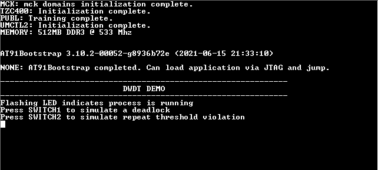
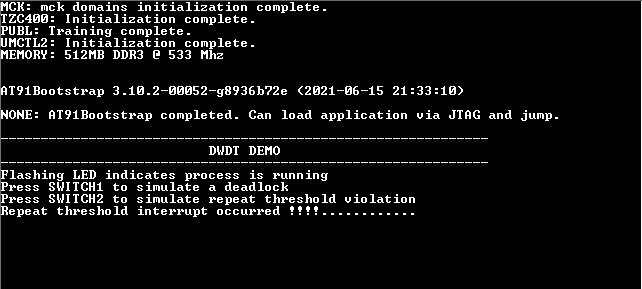

# DWDT timeout

This example application shows how to generate a Dual Watchdog timer reset by simulating a deadlock.

## Description

This example application configures Programmable secure dual watchdog timer (PS-WDT) to run in window watchdog mode. Watchdog period is 4 seconds, with 1 second repeat threshold and 3 second level threshold. Two switches are used to simulate deadlock and repeat threshold violation. Blinking LED simulates a normal process. When the application is run, the watchdog is cleared after every 2 seconds.

Pressing switch 1, will emulate a deadlock by not clearing the watchdog. LED will remain turned on. 3 seconds after previous watchdog clear, level interrupt will be generated. 4 second after previous watchdog clear, MCU will be reset. 

Pressing Switch 4 will result in a watchdog clear, if the repeat threshold have not elapsed since the previous watchdog clear, this will result in a repeat threshold violation interrupt. Pressing Switch 4 twice in quick succession will result in a guaranteed repeat threshold violation. 

## Downloading and building the application

To clone or download this application from Github, go to the [main page of this repository](https://github.com/Microchip-MPLAB-Harmony/csp_apps_sam_a7g5) and then click Clone button to clone this repository or download as zip file.
This content can also be downloaded using content manager by following these [instructions](https://github.com/Microchip-MPLAB-Harmony/contentmanager/wiki).

Path of the application within the repository is **apps/dwdt/dwdt_timeout/firmware** .

To build the application, refer to the following table and open the project using its IDE.

| Project Name      | Description                                    |
| ----------------- | ---------------------------------------------- |
| sam_a7g5_ek.X | MPLABX project for [SAMA7G5 Evaluation Kit](https://www.microchip.com/DevelopmentTools/ProductDetails) |

## Setting up AT91Bootstrap loader

To load the application binary onto the target device, we need to use at91bootstrap loader. Refer to the [at91bootstrap loader documentation](../../docs/readme_bootstrap.md) for details on how to configure, build and run bootstrap loader project and use it to bootstrap the application binaries.

## Setting up the hardware

The following table shows the target hardware for the application projects.

| Project Name| Board|
|:---------|:---------:|
| sam_a7g5_ek.X | [SAMA7G5 Evaluation Kit](https://www.microchip.com/DevelopmentTools/ProductDetails) |

### Setting up [SAMA7G5 Evaluation Kit](https://www.microchip.com/DevelopmentTools/ProductDetails)

#### Setting up the board

- Connect a 5V power supply to the board. This can be either of the following:
    - A USB cable connected between "USBA" (J7) connector on the board and USB host port on PC 
    - A 5V DC adapter connected to "5V DC IN" (J1) connector on board 
- Connect the Debug USB port (J24) on the board to the computer using a micro USB cable
- Remove DISABLE_BOOT (J21) jumper as this is required for using SW4 switch

## Running the Application

1. Open the Terminal application (Ex.:Tera term) on the computer
2. Connect to the EDBG/Jlink Virtual COM port and configure the serial settings as follows:
    - Baud : 115200
    - Data : 8 Bits
    - Parity : None
    - Stop : 1 Bit
    - Flow Control : None
3. Build and run the application using its IDE
4. Console should show the following output and LED should be blinking

    

5. Press Switch 4 twice in close succession to emulate a repeat threshold violation (Pressing once may generate the violation however, pressing twice will guarantee it)
6. Console should update the output as follows:

    

7. Press Switch 1 to emulate a deadlock
8. LED stops blinking and after few seconds console output will be updated as follows:

        
    *NOTE: Number of seconds can be between 1 and 4 based on the interval*

9. Processor resets after specified time is elapsed

Refer to the following table for Switch names for different boards:

| Board                      | Switch 1 | Switch 4 |
| -------------------------- | -------- |--------- |
| [SAMA7G5 Evaluation Kit]() | SW1      | SW4      |
