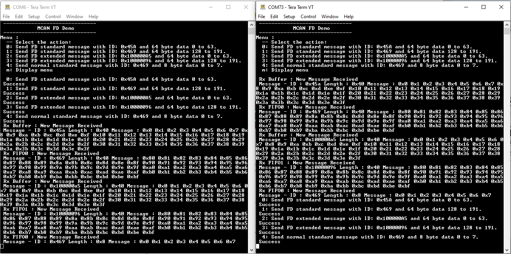

# MCAN FD blocking

This example shows how to use the MCAN module to transmit and receive CAN FD messages in polling mode.

## Description

This application transmits and receives CAN FD messages on the CAN bus. To run this application, two evaluation boards of same type are required. These boards acts as different nodes on the CAN bus. Same application is programmed onto both the boards. Boards are connected to PC via UART. While running the application, user can send and receive CAN FD messages between the boards using UART console applications running on the PC.

### MCAN Message RAM configuration
- Allocate MCAN Message RAM configuration in contiguous non-cacheable buffer in the application.
  For example, uint8_t CACHE_ALIGN mcan0MessageRAM[MCAN0_MESSAGE_RAM_CONFIG_SIZE] __attribute__((__section__(".region_sram"))); 

## Downloading and building the application

To clone or download this application from Github, go to the [main page of this repository](https://github.com/Microchip-MPLAB-Harmony/csp_apps_sam_a7g5) and then click **Clone** button to clone this repository or download as zip file.
This content can also be downloaded using content manager by following these [instructions](https://github.com/Microchip-MPLAB-Harmony/contentmanager/wiki).

Path of the application within the repository is **apps/mcan/mcan_fd_operation_blocking/firmware** .

To build the application, refer to the following table and open the project using its IDE.

| Project Name      | Description                                    |
| ----------------- | ---------------------------------------------- |
| sam_a7g5_ek.X | MPLABX project for [SAMA7G5 Evaluation Kit]() |
|||

## Setting up AT91Bootstrap loader

To load the application binary onto the target device, we need to use at91bootstrap loader. Refer to the [at91bootstrap loader documentation](../../docs/readme_bootstrap.md) for details on how to configure, build and run bootstrap loader project and use it to bootstrap the application binaries.

## Setting up the hardware

The following table shows the target hardware for the application projects.

| Project Name| Board|
|:---------|:---------:|
| sam_a7g5_ek.X | [SAMA7G5 Evaluation Kit]() |
|||

### Setting up [SAMA7G5 Evaluation Kit]()

#### Setting up the board

- SDMMC slot used for bootloading the application is SDMMC1 (J4)
- Connect SAMA7G5 Evaluation Kit board to another SAMA7G5 Evaluation Kit board as per the pin connections shown below

| SAMA7G5 EK - 1    | SAMA7G5 EK - 2    |
| ----------------- | ------------------ |
| PIN 1, J17        | PIN 1, J17         |
| PIN 2, J17        | PIN 2, J17         |
| GND               | GND                |
|||

- Connect the USB port J7 on board to the computer using a micro USB cable (to power the board)
- Connect the USB port J24 on board to the computer using a micro USB cable (to enable debug com port)

## Running the Application

1. Build the application using its IDE
2. Open the Terminal application (Ex.:Tera term) on the computer for each board.
3. Connect to the Jlink Virtual COM port of both the boards and configure the serial settings as follows:
    - Baud : 115200
    - Data : 8 Bits
    - Parity : None
    - Stop : 1 Bit
    - Flow Control : None
4. In the console associated with board 1, press "0" to transmit a CAN FD message
5. Transmitted message description and status will be displayed in the console window of board 1
6. Received message will be displayed in the console window of board 2
7. Follow the sequence below to send and receive different messages:
    - Press '1' on board 1
    - Press '2' on board 1
    - Press '3' on board 1
    - Press '4' on board 1
    - Press '0' on board 2
    - Press '1' on board 2
    - Press '2' on board 2
    - Press '3' on board 2
    - Press '4' on board 2
8. If the steps are executed in this sequence, the final output in the consoles will be as below:

  
