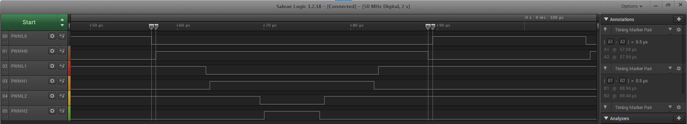

# PWM Generation

This example shows how to use the PWM peripheral to generate 3-phase PWM signals with dead time.

## Description

This example shows how to configure the PWM to generate synchronous 3-phase PWM signals with dead time (used for motor control). The duty cycle of the PWM is updated in the interrupt handler.

## Downloading and building the application

To clone or download this application from Github, go to the [main page of this repository](https://github.com/Microchip-MPLAB-Harmony/csp_apps_sam_a7g5) and then click **Clone** button to clone this repository or download as zip file.
This content can also be downloaded using content manager by following these [instructions](https://github.com/Microchip-MPLAB-Harmony/contentmanager/wiki).

Path of the application within the repository is **apps/pwm/pwm_synchronous_channels/firmware** .

To build the application, refer to the following table and open the project using its IDE.

| Project Name      | Description                                    |
| ----------------- | ---------------------------------------------- |
| sam_e70_xult.X    | MPLABX Project for [SAMA7G5 Evaluation Kit](https://www.microchip.com/DevelopmentTools/ProductDetails)|

## Setting up AT91Bootstrap loader

To load the application binary onto the target device, we need to use at91bootstrap loader. Refer to the [at91bootstrap loader documentation](../../docs/readme_bootstrap.md) for details on how to configure, build and run bootstrap loader project and use it to bootstrap the application binaries.

## Setting up the hardware

The following table shows the target hardware for the application projects.

| Project Name| Board|
|:---------|:---------:|
|sam_e70_xult.X | [SAMA7G5 Evaluation Kit](https://www.microchip.com/DevelopmentTools/ProductDetails)|

### Setting up [SAMA7G5 Evaluation Kit](https://www.microchip.com/DevelopmentTools/ProductDetails)

- Connect the Debug USB port on the board to the computer using a micro USB cable

## Running the Application

1. Build and Program the application using their respective IDEs
2. Observe the high-side and low-side PWM waveforms on the oscilloscope
3. Observe the dead time between the high side and low side

    

Refer to the below table for PWM output pins for different boards:

| PWM Channel      | [SAMA7G5 Evaluation Kit](https://www.microchip.com/DevelopmentTools/ProductDetails) |
|:---------|:---------------------- |
| CH0_PWML | PE02 (Pin 32 of RPi connector(J13)) |
| CH0_PWMH | PE03 (Pin 38 of RPi connector(J13))|
| CH1_PWML | PE04 (Pin 35 of RPi connector(J13))|
| CH1_PWMH | PE05 (Pin 40 of RPi connector(J13))|
| CH2_PWML | PE06 (Pin 12 of RPi connector(J13))|
| CH2_PWMH | PE07 (Pin 11 of RPi connector(J13)) |
