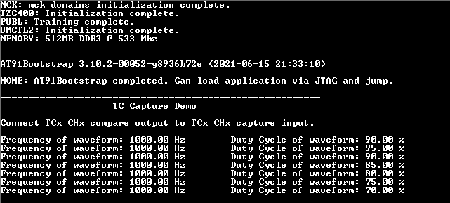

# TC capture mode

This example application shows how to use the TC module in capture mode to measure duty cycle and frequency of an external input.

## Description

The TC channel is configured in capture mode to measure duty cycle and frequency of the PWM signal. The PWM signal is generated using another TC channel which is configured in compare mode. Output of the compare TC channel is connected to input of the capture TC channel.

## Downloading and building the application

To clone or download this application from Github, go to the [main page of this repository](https://github.com/Microchip-MPLAB-Harmony/csp_apps_sam_a5d2) and then click Clone button to clone this repository or download as zip file.
This content can also be downloaded using content manager by following these [instructions](https://github.com/Microchip-MPLAB-Harmony/contentmanager/wiki).

Path of the application within the repository is **apps/tc/tc_capture_mode/firmware** .

To build the application, refer to the following table and open the project using its IDE.

| Project Name      | Description                                    |
|:-----------------:|:----------------------------------------------:|
| sam_a7g5_ek.X | MPLABX project for [SAMA7G5 Evaluation Kit](https://www.microchip.com/DevelopmentTools/ProductDetails) |

## Setting up AT91Bootstrap loader

To load the application binary onto the target device, we need to use at91bootstrap loader. Refer to the [at91bootstrap loader documentation](../../docs/readme_bootstrap.md) for details on how to configure, build and run bootstrap loader project and use it to bootstrap the application binaries.

## Setting up the hardware

The following table shows the target hardware for the application projects.

| Project Name| Board|
|:---------|:---------:|
| sam_a7g5_ek.X | [SAMA7G5 Evaluation Kit](https://www.microchip.com/DevelopmentTools/ProductDetails) |

### Setting up [SAMA7G5 Evaluation Kit](https://www.microchip.com/DevelopmentTools/ProductDetails)

#### Setting up the board

- Connect a 5V power supply to the board. This can be either of the following:
    - A USB cable connected between "USBA" (J7) connector on the board and USB host port on PC 
    - A 5V DC adapter connected to "5V DC IN" (J1) connector on board 
- Connect the Debug USB port (J24) on the board to the computer using a micro USB cable
- Short TIOA pin of TC0, Channel 2 with TIOA pin of TC2, Channel 0

## Running the Application

1. Open the Terminal application (Ex.:Tera term) on the computer.
2. Connect to the EDBG/Jlink Virtual COM port and configure the serial settings as follows:
    - Baud : 115200
    - Data : 8 Bits
    - Parity : None
    - Stop : 1 Bit
    - Flow Control : None
3. Build and program the application using its IDE
4. Console displays frequency and duty cycle of input signal as shown below

    

5. Frequency is constant (~1000 Hz) and duty cycle changes by ~5%

| Board | Compare output pin | Capture input pin |
|:---------|:---------:|:-----------:|
| [SAMA7G5 Evaluation Kit](https://www.microchip.com/DevelopmentTools/ProductDetails) | TC0_TIOA2 (PE1, RPi connector PIN 36) | TC1_TIOA0 (PE4, RPi connector PIN 35) |
